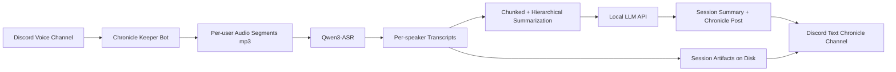

# Discord Chronicle Keeper

Discord bot for DnD/TTRPG with a fully local pipeline:
- record a Discord voice channel;
- transcribe audio through local `Qwen3-ASR` inference in Python;
- generate a summary and player-facing chronicle post through a local OpenAI-compatible LLM endpoint (LM Studio or Docker model runner);
- publish everything to a dedicated text channel for chronicles.

## Choose Run Mode

Pick one path first, then follow only that section:

1. Local Python app + local Qwen ASR + external LLM endpoint.
2. Docker Compose + LM Studio (default bot service, no Docker LLM model).
3. Docker Compose + Docker model runner (`docker-llm` profile, no LM Studio required).
4. Optional: run Node voice sidecar skeleton (`voice-sidecar` profile, control API only).

## Quickstart (5 min, Local Python Mode)

1. Clone repo and install Python deps:
```bash
python -m venv .venv
source .venv/bin/activate
python -m pip install --upgrade pip
pip install -r requirements.txt
cp .env.example .env
```
Windows PowerShell equivalent:
```powershell
python -m venv .venv
Set-ExecutionPolicy -Scope Process -ExecutionPolicy Bypass
.\.venv\Scripts\Activate.ps1
python -m pip install --upgrade pip
pip install -r requirements.txt
Copy-Item .env.example .env
```
2. Fill `.env` basic keys:
   - `DISCORD_BOT_TOKEN`
   - `ASR_BACKEND=qwen3_asr` (default) or `ASR_BACKEND=vibevoice_asr`
   - `LLM_BASE_URL`
   - `LLM_MODEL`

   For Docker bot mode, `LLM_BASE_URL` must be reachable from container
   (not `127.0.0.1` unless bot runs outside Docker).
3. Start bot:
```bash
python -m chronicle_keeper.bot
```
4. In Discord, run:
- `/chronicle_setup_channels`
- `/chronicle_start`
- `/chronicle_stop`

## Docs

Additional practical documentation:
- `docs/architecture.md` - system architecture and data flow.
- `docs/config-reference.md` - environment variable reference and backend presets.
- `docs/operations.md` - day-to-day runbook (start/stop/switch/reprocess/recovery).
- `docs/troubleshooting.md` - common errors and fixes.
- `docs/performance-tuning.md` - quality/speed tuning guidelines.

## Architecture



## Privacy and Consent

- This bot records voice conversations and stores local artifacts under `data/sessions/`.
- Use this bot only with explicit participant consent and in compliance with local laws/Discord policies.
- Review and manage retention of generated artifacts (`audio`, transcripts, summaries, checkpoints).
- Do not commit secrets or private session artifacts to git.
- See `SECURITY.md` for vulnerability reporting and `SUPPORT.md` for support channels.

## Diarization Notes

Standalone diarization is not required: the bot receives separate tracks per Discord user (voice receive) and labels transcripts with Discord nicknames (`display_name`). In practice, this is usually better than post-diarization on a mixed track.

## Requirements

- Python 3.11+
- `ffmpeg` in `PATH` (for WAV -> MP3 compression)
- Discord bot token
- Local ASR via Python (`ASR_BACKEND=qwen3_asr` or `ASR_BACKEND=vibevoice_asr`)
- OpenAI-compatible LLM endpoint:
  - LM Studio (usually `http://127.0.0.1:1234/v1`), or
  - Docker Compose model runner (`docker-llm` profile)

## Detailed Setup

Quickstart above is enough for most users. Use this section for platform-specific prerequisites and tuning.

### Linux / WSL prerequisites
```bash
sudo apt update
sudo apt install -y python-is-python3 python3-venv
```

### Windows PowerShell prerequisites
```powershell
python -m venv .venv
Set-ExecutionPolicy -Scope Process -ExecutionPolicy Bypass
.\.venv\Scripts\Activate.ps1
# Optional fallback if voice deps fail:
pip install pynacl
```

### ffmpeg check (required for MP3 compression)
```powershell
winget install -e --id Gyan.FFmpeg
Get-Command ffmpeg
where.exe ffmpeg
ffmpeg -version
```

If `ffmpeg` is not found after install, restart PowerShell and check again.

### Runtime config highlights

- `ASR_BACKEND=qwen3_asr|vibevoice_asr`
- Shared ASR defaults:
  - `ASR_LANGUAGE=ru|uk|en`
  - `ASR_DTYPE=auto|bfloat16|float16|float32`
  - `ASR_MAX_NEW_TOKENS` (global cap; backend-specific overrides optional)
- `AUDIO_DUAL_PIPELINE_ENABLED=false` (default): single transcription pass from processed audio.
- `AUDIO_DUAL_PIPELINE_ENABLED=true`: dual pass:
  raw pass can be used as fallback text source, primary transcript text still comes from processed audio.
  This may improve robustness on noisy segments but increases processing time.
- `QWEN3_ASR_*` options are only needed for Qwen-specific tuning.
- `QWEN3_ASR_ATTN_IMPLEMENTATION=sdpa|flash_attention_2` switches attention backend.
- `LLM_WARMUP_ON_START=true` sends a tiny startup LLM completion request to reduce first summary latency.
- `LLM_CHRONICLE_MIN_WORDS` / `LLM_CHRONICLE_MAX_WORDS` control target length of the Player-Facing Chronicle Post section.
- Optional LM Studio auto-load on demand:
  - `LMSTUDIO_AUTO_LOAD=true`
  - model is always taken from `LLM_MODEL`
  - optional override: `LMSTUDIO_CONTROL_BASE_URL` (if control API is on a different host/base)
  - optional path: `LMSTUDIO_CONTROL_LOAD_PATH=/api/v1/models/load`
  - if endpoint returns "No models loaded", bot requests model load once and retries completion.
- `AUDIO_NORMALIZE=false` (default): only MP3 compression.
- `AUDIO_NORMALIZE=true`: apply mild normalization (`highpass + loudnorm`) before ASR.
- `AUDIO_VAD_ENABLED=false` (default): keep pauses/silence as-is.
- `AUDIO_VAD_ENABLED=true`: trim longer silence using conservative ffmpeg `silenceremove` settings.
- `AUDIO_MP3_VBR_QUALITY=4` (default): MP3 VBR quality (`0` best/largest .. `9` smallest).
- `AUDIO_TARGET_CHANNELS=0` / `AUDIO_TARGET_SAMPLE_RATE=0` (default): keep source channels/sample-rate.
- Recommended long-session preset: `AUDIO_DUAL_PIPELINE_ENABLED=true`, `AUDIO_NORMALIZE=true`, `AUDIO_TARGET_CHANNELS=1`, `AUDIO_TARGET_SAMPLE_RATE=16000`.
- Keep `AUDIO_VAD_ENABLED=false` for the first pass unless you specifically need silence trimming.
- Optional sidecar routing (draft): `VOICE_SIDECAR_ENABLED=true` with `VOICE_SIDECAR_BASE_URL=http://127.0.0.1:8081` and shared `SIDECAR_TOKEN`.
- Optional live ASR in sidecar mode: `LIVE_CHUNK_TRANSCRIBE_ON_ROTATION=true` (incremental ASR kicks in after each rotation, so final stop is mostly summary work).
- Speech-friendly preset example: `AUDIO_TARGET_CHANNELS=1`, `AUDIO_TARGET_SAMPLE_RATE=16000`, `AUDIO_MP3_VBR_QUALITY=5`.
- Extra compact preset example: `AUDIO_TARGET_CHANNELS=1`, `AUDIO_TARGET_SAMPLE_RATE=16000`, `AUDIO_MP3_VBR_QUALITY=6`.
- Voice decode burst guard (auto recovery for repeated decode failures):
  - `VOICE_DECODE_BURST_WINDOW_SECONDS=15`
  - `VOICE_DECODE_BURST_THRESHOLD=8`
  - `VOICE_DECODE_BURST_COOLDOWN_SECONDS=60`
  - when threshold is hit, bot forces segment rollover and reconnect; counters are visible in `/chronicle_status`.

Long session processing options:
- `PROCESSING_TIMEOUT_SECONDS=7200` sets max end-of-session processing time.
- Optional context relevance gate for off-topic sessions:
  - `SUMMARY_CONTEXT_RELEVANCE_GATE=true`
  - `SUMMARY_CONTEXT_MIN_RELEVANCE=0.40`
  - if transcript relevance is below threshold, summary runs without campaign context/hints.
- `RECORDING_ROTATION_SECONDS=1800` rotates recording into segments every 30 min (set `0` to disable).
- `RECOVERY_AUTO_POST_PARTIAL=true` attempts startup recovery post for unfinished sessions.
- `RECOVERY_MAX_SESSIONS=20` limits how many unfinished sessions are auto-posted per startup.
- Active runtime session state is persisted at `data/runtime/active_sessions.json`.
- The bot now writes processing checkpoints to `data/sessions/<guild_id>/<session_ts>/processing_state.json`.
- In Discord, full transcript is posted as attached `full_transcript.txt` instead of inline long messages.
- Bot posts `mixed_session.mp3` by default (single convenient listening track).
- Optional per-speaker audio posting is available via `PUBLISH_PER_SPEAKER_AUDIO=true`.

## Docker

Build image:

```bash
docker build -t discord-chronicle-keeper .
```

Run container:

```bash
docker run --rm \
  --name discord-chronicle-keeper \
  --env-file .env \
  -v "$(pwd)/data:/app/data" \
  discord-chronicle-keeper
```

If Qwen ASR and LLM run on your host machine, set these in `.env`:

```env
LLM_BASE_URL=http://<host-ip-or-dns>:1234/v1
```

## Qwen3-ASR experiment

You can try Qwen3-ASR locally without changing the bot pipeline.

### Create transcript test envs (Windows)

Baseline env (`sdpa`):

```powershell
python -m venv .venv
.\.venv\Scripts\Activate.ps1
python -m pip install --upgrade pip
pip install -r requirements.txt
```

FlashAttention env (`flash_attention_2`):

```powershell
python -m venv .venv-fa2-win283
.\.venv-fa2-win283\Scripts\Activate.ps1
python -m pip install --upgrade pip setuptools wheel
python -m pip install torch==2.8.0 --index-url https://download.pytorch.org/whl/cu129
python -m pip install "https://github.com/LDNKS094/flash_attn_windows_2.8.3/releases/download/v2.8.3/flash_attn-2.8.3%2Btorch2.8.0cu129-cp312-cp312-win_amd64.whl"
python -m pip install qwen-asr transformers numpy soundfile librosa
```

Quick sanity checks:

```powershell
.\.venv\Scripts\python.exe -c "import torch; print(torch.__version__, torch.cuda.is_available())"
.\.venv-fa2-win283\Scripts\python.exe -c "import torch, flash_attn; print(torch.__version__, torch.cuda.is_available(), flash_attn.__version__)"
```

Bootstrap helper (creates base and/or flash env):

```powershell
powershell -ExecutionPolicy Bypass -File .\scripts\bootstrap_qwen_envs.ps1 -Base
powershell -ExecutionPolicy Bypass -File .\scripts\bootstrap_qwen_envs.ps1 -Flash
```

One-shot benchmark (SDPA vs FlashAttention2 on one audio file):

```powershell
.\.venv\Scripts\python.exe scripts/benchmark_qwen_envs.py `
  --audio data/sessions/1373716879985873016/20260227_173322/audio/___911732749860212746_seg001.mp3
```

Install the minimal package (baseline `.venv`):

```powershell
.\.venv\Scripts\python.exe -m pip install -U qwen-asr
```

Run a local audio file through the transformers backend:

```powershell
.\.venv\Scripts\python.exe scripts/test_qwen3_asr.py `
  --audio data/sessions/1373716879985873016/20260227_173322/audio/___911732749860212746_seg001.mp3 `
  --language Russian
```

Try timestamps with the optional forced aligner:

```powershell
.\.venv\Scripts\python.exe scripts/test_qwen3_asr.py `
  --audio data/sessions/1373716879985873016/20260227_173322/audio/___911732749860212746_seg001.mp3 `
  --language Russian `
  --forced-aligner Qwen/Qwen3-ForcedAligner-0.6B `
  --return-time-stamps
```

The script prints backend, GPU visibility, dtype, and transcript text.


### VibeVoice-ASR (separate env)

Create dedicated env (keeps main `.venv` untouched):

```powershell
powershell -ExecutionPolicy Bypass -File .\scripts\bootstrap_vibe_env.ps1
```

Manual one-file run:

```powershell
.\.venv-vibe\Scripts\python.exe scripts/test_vibevoice_asr.py `
  --audio data/sessions/1373716879985873016/20260227_173322/audio/___911732749860212746_seg001.mp3 `
  --language Russian
```

Use VibeVoice inside bot runtime:

```env
ASR_BACKEND=vibevoice_asr
VIBEVOICE_PYTHON=.\.venv-vibe\Scripts\python.exe
VIBEVOICE_SCRIPT=scripts/test_vibevoice_asr.py
VIBEVOICE_MODEL=microsoft/VibeVoice-ASR-HF
```

Shared ASR params are reused by both backends:

```env
ASR_LANGUAGE=ru
ASR_DTYPE=float16
ASR_MAX_NEW_TOKENS=4096
```
To use Qwen3-ASR inside the bot itself, set:

```env
ASR_BACKEND=qwen3_asr
QWEN3_ASR_MODEL=Qwen/Qwen3-ASR-1.7B
ASR_DTYPE=float16
```

## Docker Compose

This repo includes compose services for both LLM modes:
- `bot` (default): Discord Chronicle Keeper + external LM Studio endpoint
- `bot_docker_llm` (`docker-llm` profile): Discord Chronicle Keeper + Docker model runner
- `bot_sidecar` (`voice-sidecar` profile): bot preconfigured for sidecar mode (`VOICE_SIDECAR_ENABLED=true`)
- `voice_sidecar` (`voice-sidecar` profile): Node voice runtime + control API
- `llm` model via Docker Compose models: `ai/gpt-oss:20B-MXFP4`

Start stack with LM Studio (default LLM backend):

```bash
docker compose up -d --build --remove-orphans
```

Start stack with Docker model runner:

```bash
docker compose --profile docker-llm up -d --build --remove-orphans --scale bot=0
```

View logs (LM Studio mode):

```bash
docker compose logs -f bot
```

View logs (Docker LLM mode):

```bash
docker compose logs -f bot_docker_llm
```

Stop:

```bash
docker compose down
```

Start only sidecar runtime/API (for contract/integration testing):

```bash
docker compose --profile voice-sidecar up -d --build
curl http://127.0.0.1:8081/health
```

Smoke sidecar contract (health/start/status/rotate/stop):

```bash
python scripts/smoke_sidecar.py --base-url http://127.0.0.1:8081
```

Manual sidecar E2E (real voice capture to WAV):

```bash
python scripts/smoke_sidecar_e2e.py --base-url http://127.0.0.1:8081 --guild-id <guild_id> --voice-channel-id <voice_channel_id> --rotate-once
```

Notes:
- Compose model injection sets:
  - `LLM_BASE_URL` (endpoint URL)
  - `LLM_MODEL` (selected model name)
- The bot uses generic `LLM_*` env vars, so you can run any OpenAI-compatible local endpoint manually or through compose models.
- LLM model config sets max context `131072`.
- On startup the bot runs a lightweight config doctor and logs obvious misconfiguration warnings.
- Sidecar contract (draft): `docs/voice-sidecar-contract.md`.

Sidecar + bot mode (draft path, with health-gated startup):

```bash
docker compose --profile voice-sidecar up -d --build --remove-orphans --scale bot=0
```
(`bot_sidecar` waits for healthy `voice_sidecar`; `--scale bot=0` disables default bot to avoid duplicate Discord login.)

### Smoke E2E (ASR + LLM)

Run a quick end-to-end health check using latest recorded audio:

```bash
python scripts/smoke_e2e.py
```

Or target a specific file:

```bash
python scripts/smoke_e2e.py --audio data/sessions/<guild>/<session>/audio/mixed_session.mp3
```

## Slash Commands

- `/chronicle_setup` - set report text channel (dropdown channel picker).
- `/chronicle_setup_here` - set current text channel for reports.
- `/chronicle_setup_voice` - set default voice channel for recording (dropdown channel picker).
- `/chronicle_setup_voice_here` - set your current voice channel as default recording channel.
- `/chronicle_setup_channels` - one command to set both voice channel and transcript text channel.
- `/chronicle_defaults_language` - set guild default summary language (`en`, `uk`, `ru`).
- `/chronicle_defaults_context` - set guild default session context text.
- `/chronicle_defaults_names` - set guild default canonical names/roles hints.
- `/chronicle_campaign_create` - create a campaign.
- `/chronicle_campaign_list` - list campaigns.
- `/chronicle_campaign_use` - set active campaign.
- `/chronicle_campaign_show` - show active campaign effective settings.
- `/chronicle_campaign_context` - update active campaign context.
- `/chronicle_campaign_names` - update active campaign names/roles hints.
- `/chronicle_campaign_language` - update active campaign language override.
- `/chronicle_campaign_lang_clear` - clear active campaign language override (fallback to guild default).
- `/chronicle_campaign_summarize` - generate one final summary across all sessions in campaign.
- `/chronicle_campaign_sum_range` - generate campaign summary with date-range and session-limit filters.
- `/chronicle_status` - show current recorder status and reconnect/rotation/decode-burst counters, plus runtime metrics (calls/errors/latency by stage).
- `/chronicle_reconnect` - force voice reconnect and try to resume recording manually.
- `/chronicle_reprocess_last` - reprocess latest saved session for this guild and republish transcript/summary.
- `/chronicle_reprocess` - reprocess specific session by session id.
- `/chronicle_repost` - repost existing artifacts for a specific session without reprocessing.
- `/chronicle_sessions` - list recent sessions for this guild.
- `/chronicle_session_move` - move a session to another campaign (optional reprocess).
- `/chronicle_start` - start recording in configured default voice channel; if not configured, uses your current voice channel.
- `/chronicle_stop` - stop recording, build transcript and summary, publish to the chronicle channel.
- `/chronicle_leave` - disconnect the bot from voice.
- `/chronicle_cleanup_now` - run retention cleanup immediately (Manage Server required).
- `/chronicle_purge_session` - delete one saved session by id (Manage Server required, `ALLOW_PURGE_COMMANDS=true`).
- `/chronicle_purge_guild_data` - delete all saved sessions for this guild (Manage Server required; requires `PURGE` confirmation and `ALLOW_PURGE_COMMANDS=true`).

Note:
- `/chronicle_start` requires an active campaign (`/chronicle_campaign_create` + `/chronicle_campaign_use`).

## Campaign Workflow (Recommended)

Use this sequence to record multiple sessions into one campaign cleanly:

1. Initial setup (once per guild):
   - `/chronicle_setup_channels` (or `/chronicle_setup_voice_here` + `/chronicle_setup_here`)
2. Create campaign:
   - `/chronicle_campaign_create`
3. Activate campaign before recording:
   - `/chronicle_campaign_use` (dropdown)
4. Optional campaign-level context:
   - `/chronicle_campaign_context`
   - `/chronicle_campaign_names`
   - `/chronicle_campaign_language` (or `/chronicle_campaign_lang_clear` to use guild default)
5. For each game session:
   - `/chronicle_start`
   - `/chronicle_stop`
6. If needed:
   - Reprocess latest: `/chronicle_reprocess_last`
   - Reprocess specific: `/chronicle_reprocess` (dropdown)
   - Move session to another campaign: `/chronicle_session_move` (dropdowns)
7. Final campaign summary:
   - All sessions: `/chronicle_campaign_summarize`
   - Filtered range: `/chronicle_campaign_sum_range`

## Current Limitations

- Transcription is generated per-user track and merged into speaker buckets; it is not a sample-accurate multi-speaker chat log.
- Large sessions are better posted in parts: the bot already chunks long messages to fit Discord limits.
- Voice reconnect/recovery is best-effort; hard crashes can still lose in-memory data between segment rotations.
- Discord file size limits can prevent uploading `.mp3` artifacts in-channel; full files remain on disk.
- Quality report is heuristic (duration/bitrate/reconnect/rotation counters) and not a full audio QA system.
- If `AUDIO_VAD_ENABLED=true`, silence trimming can remove non-speech and affect transcript flow.
  If needed, compare with `AUDIO_VAD_ENABLED=false` for validation.

## Versioning

This project follows Semantic Versioning (`MAJOR.MINOR.PATCH`):
- `PATCH`: bug fixes and internal improvements.
- `MINOR`: backward-compatible features.
- `MAJOR`: breaking changes.

Track releases and notable changes in `CHANGELOG.md`.
Release checklist is documented in `RELEASE.md`.

## License

This project is dual-licensed:
- `AGPL-3.0-or-later`
- Commercial license (for proprietary/commercial use without AGPL obligations)

See:
- `LICENSE`
- `COMMERCIAL_LICENSE.md`
- `CONTRIBUTING.md` (contribution licensing terms)

## Third-party Components

This repository references third-party Docker images, models, and dependencies.
They are licensed by their respective owners.
You are responsible for reviewing and complying with third-party license terms
when building, running, or redistributing derived artifacts.

## Data Lifecycle

Retention and cleanup are configurable in `.env`:
- `AUTO_CLEANUP_ENABLED=true|false` (default: `false`)
- `AUTO_CLEANUP_ON_START=true|false` (default: `false`)
- `RETENTION_DAYS=<N>`
- `ALLOW_PURGE_COMMANDS=true|false` (default: `false`)

Manual lifecycle commands:
- `/chronicle_cleanup_now`
- `/chronicle_purge_session`
- `/chronicle_purge_guild_data`

## Backup and Restore

Recommended backup target:
- `data/guild_settings.json`
- `data/sessions/`

Example backup:

```bash
tar -czf chronicle-backup-$(date +%Y%m%d_%H%M%S).tar.gz data/guild_settings.json data/sessions
```

Example restore:

```bash
tar -xzf chronicle-backup-YYYYMMDD_HHMMSS.tar.gz
```

After restore:
1. Start bot.
2. Review startup recovery messages in chronicle channels.
3. Run `/chronicle_cleanup_now` if retention policy should be applied immediately.

## Reprocess Saved Session (CLI)

Use this to rebuild transcript/summary from already recorded audio artifacts:

```bash
python -m chronicle_keeper.reprocess --session-dir data/sessions/<guild_id>/<session_id> --language ru
```

Alternative form:

```bash
python -m chronicle_keeper.reprocess --guild-id <guild_id> --session-id <session_id> --language ru
```

This command reads files from `audio/`, re-runs ASR + LLM processing, and rewrites:
- `transcripts/*.md`
- `full_transcript.md`
- `full_transcript.txt`
- `summary.md`

Summary-only mode (reuse existing transcripts, refresh only `summary.md`):

```bash
python -m chronicle_keeper.reprocess --session-dir data/sessions/<guild_id>/<session_id> --language ru --summary-only
```

Transcribe-only mode (incremental by default, no summary generation):

```bash
python -m chronicle_keeper.reprocess --session-dir data/sessions/<guild_id>/<session_id> --transcribe-only
```

Force full retranscription in transcribe-only mode:

```bash
python -m chronicle_keeper.reprocess --session-dir data/sessions/<guild_id>/<session_id> --transcribe-only --force-transcribe
```

## Local Smoke Test Without Discord

You can test full ASR+summary pipeline locally (no Discord join/start needed):

```bash
python scripts/smoke_local_pipeline.py --audio <path_to_audio_file> --language ru
```

To emulate rotation (split source into chunk-like segments first):

```bash
python scripts/smoke_local_pipeline.py --audio <path_to_audio_file> --segment-seconds 60 --language ru
```

To explicitly test split flow (transcribe-only then summary-only):

```bash
python scripts/smoke_local_pipeline.py --audio <path_to_audio_file> --mode split --segment-seconds 60 --language ru
```

## Repost Saved Artifacts To Discord (CLI)

Use this to send existing artifacts to Discord without reprocessing:

```bash
python -m chronicle_keeper.repost --session-dir data/sessions/<guild_id>/<session_id>
```

Options:
- `--channel-id <id>` - post to specific text channel (otherwise uses configured chronicle channel for guild).
- `--mention-user-id <id>` - mention DM/user in the repost header.
- `--no-mixed-audio` - skip uploading `mixed_session.mp3`.

## Testing

Install dev dependencies:

```bash
pip install -r requirements-dev.txt
```

Install pre-commit hooks:

```bash
pre-commit install
```

Run checks from repository root:

Linux / WSL:
```bash
pre-commit run --all-files
python scripts/check_repo_hygiene.py
python -m compileall chronicle_keeper
python -m mypy
python -m pytest -q
```

Windows PowerShell:
```powershell
pre-commit run --all-files
python scripts/check_repo_hygiene.py
python -m compileall chronicle_keeper
python -m mypy
python -m pytest -q
```

Optional GitHub Actions workflow:
- `Smoke E2E (Container, Optional)` (`workflow_dispatch`) builds bot + mock API containers and runs `scripts/smoke_e2e.py` inside containerized environment.

## Security

Security policy and vulnerability reporting: `SECURITY.md`

## Support

Support options and channels: `SUPPORT.md`

## Community

- Code of Conduct: `CODE_OF_CONDUCT.md`
- Production readiness checklist: `PRODUCTION_CHECKLIST.md`
